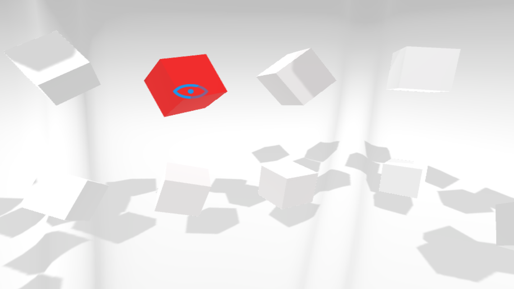

Unity SDK for EyeTribe Dev Kit
====

This is a collection of tools and utilities for  [EyeTribe Dev Kit](https://theeyetribe.com/products/) development in Unity. The package provides an interface for communicating with the EyeTribe Server from Unity through the open [EyeTribe API](http://dev.theeyetribe.com/api/). The package allows developers to get started quickly and focus their efforts on creating truly immersive and innovative apps using our eye tracking technology. 

An [EyeTribe Tracker](https://theeyetribe.com/products/)  or [EyeTribe VR Tracker](https://theeyetribe.com/wp-content/uploads/2016/01/vr-product-sheet.pdf) is required to use this library. This dev kit supports both ***remote eye-tracking*** and ***vr eye-tracking***.

Developed for and tested against [Unity 5.4.2](https://store.unity.com/download?ref=update).

Prerequisites
----
If using a ***vr eye-tracker***, it is important that you install and run [Valve SteamVR](https://support.steampowered.com/kb_article.php?ref=2001-UXCM-4439#install-steam). This run-time environment supports both Oculus & Vive HMDs. 

Unity-Sample
----

Included in the repository is a Unity sample project *'./unity-sample/'*. This sample illustrates how to calibrate the EyeTribe Server and gives an example of how to use gaze input in 3D environments. The sample supports both the *****EyeTribe Tacker***** and ***EyeTribe VR***. The calibration scene automatically adapts to both setups.

**Building (OPTIONAL)**

Find a pre-built version of this sample under [releases](https://github.com/EyeTribe/tet-unity-devkit/releases). Should you whish to build this sample yourself then follow the below instructions. 

Since dependencies in the [Eye Tribe C# SDK](https://github.com/EyeTribe/tet-csharp-client) uses reflection, a change in the Unity default project settings is needed in order to build. Please make sure that the following setting is set before building: 
*Player Settings -> Other Settings -> Api Compatibility Level -> .NET 2.0*

If building for VR, make sure to enable: 
*Player Settings -> Other Settings -> Virtual Reality Supported*

Build for desired target platform using Unity Build Settings.

**Interaction Scene**

**Input Handling**

Keyboard:

- Fire1: Left Ctrl
- Fire2: Left Alt
- Fire3: Left Shift
- Fire4: Space
- Esc: Exit app
- 1: Show/Hide GazeIndicator
- 2: Toggle raw/smooth gaze data
- 3: Show/Hide Gaze Info
- 4: Show/Hide CalibrationArea
- 5: Reduce CalibrationArea Width
- 6: Increase CalibrationArea Width
- 7: Reduce CalibrationArea Height
- 8: Increase CalibrationArea Height

GamePad:

- Fire1: X Button
- Fire2: Y Button
- Fire3: A Button, Show/Hide GazeIndicator
- Fire4: B Button, Show/Hide Gaze Info
- Back: Go Back or Exit

GearVR Touchpad:

- Fire1: Tap
- Fire2: Swipe Down
- Fire3: Swipe Back, Show/Hide GazeIndicator
- Fire4: Double-Tap, Show/Hide Gaze Info
- Back: Go Back or Exit

Unity-Commons
----

Included in the repository you'll find the ***EyeTribe.Unity*** library (./unity-commons/). This library encapsulates the [Eye Tribe C# SDK](https://github.com/EyeTribe/tet-csharp-client) & Unity Scripts common the eye tracking development into a single assembly named *EyeTribe.Unity.dll*. Building this library automatically copies the resulting assembly file to *'./unity-sample/Assets/TheEyeTribe/Plugins'*.

Find the latest ***EyeTribe.Unity.dll*** under [releases](https://github.com/EyeTribe/tet-unity-client/releases).

**Building (OPTIONAL)**

Should you choose extend this library and build it yourself, the project needs to know your Unity installation path. To set this up, open the project file *'./unity-commons/commons/unity-commons.csproj'* with a text editor. Then modify the property *$(YourUnityFolder)* to the path of your Unity installation.

    <YourUnityFolder>C:\Program Files\Unity\</YourUnityFolder>

Open the project in [Visual Studio Express 2013](https://www.microsoft.com/en-us/download/details.aspx?id=44914) or similar and build. Note that [.Net Framwork 3.5 SP1](https://www.microsoft.com/en-us/download/details.aspx?id=22) is a requirement to build a Unity supported library.

Dependencies
----
The EyeTribe Unity SDK uses the open source [Eye Tribe C# SDK](https://github.com/EyeTribe/tet-csharp-client) to communicate with the EyeTribe Server. Dependencies of this library applies here.

The EyeTribe Unity SDK contains fragments of the public [Unity VR Samples 1.1a](https://www.assetstore.unity3d.com/en/#!/content/51519) package.

Getting Help
----

- **Have questions or need support?** Visit our [developer forum](http://theeyetribe.com/forum/), to find answers to your questions and share your experiences with others developers.
- **Have a bug to report?** Open a [new issue](https://github.com/EyeTribe/tet-java-client/issues) and tell us what you are experiencing. Please add library version and full log if possible.
- **Have a feature request?** Either open a [new issue](https://github.com/EyeTribe/tet-java-client/issues) or post in our [developer forum](http://theeyetribe.com/forum/). Tell us what feature you are missing and what it should do. 

Feedback
----

If you like using this library, please consider sending out a tweet mentioning [@TheEyeTribe](twitter.com/theeyetribe), announce your app in our [developer forum](http://theeyetribe.com/forum/), or email [support@theeyetribe.com](mailto:support@theeyetribe.com) to let us know.